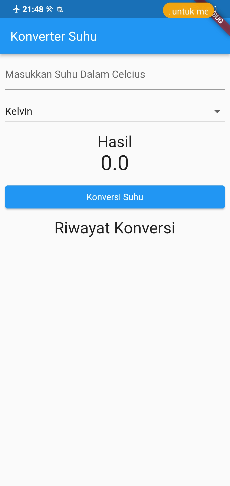
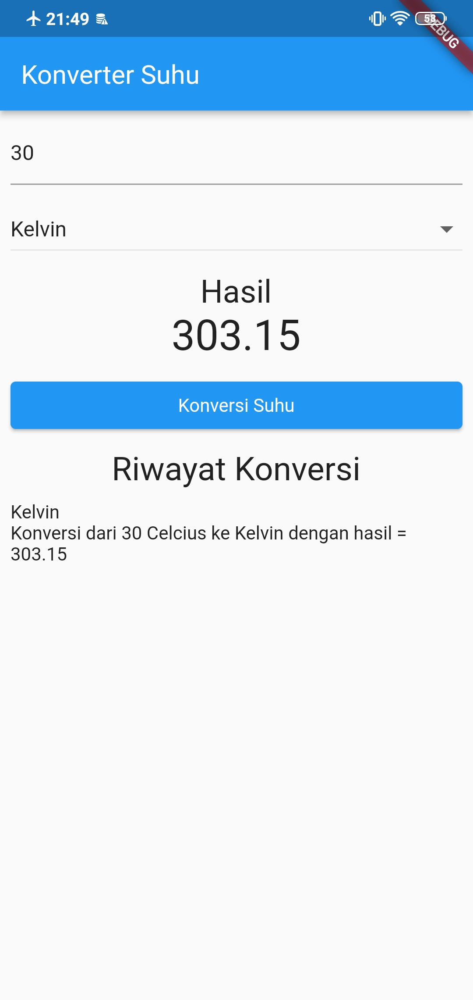
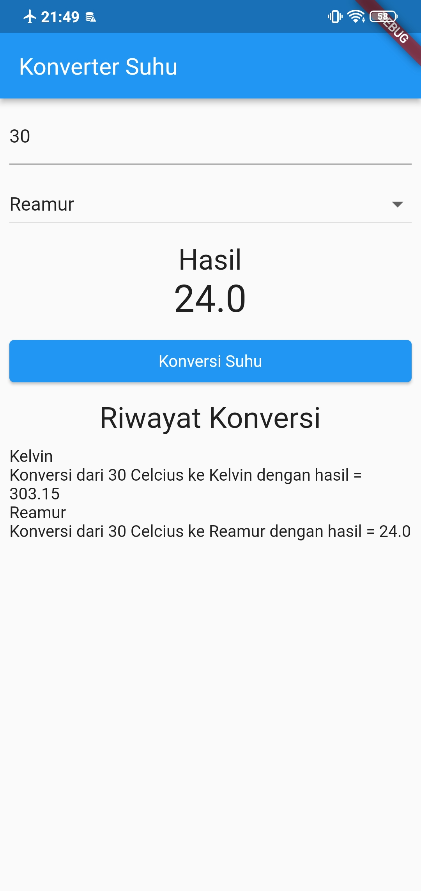
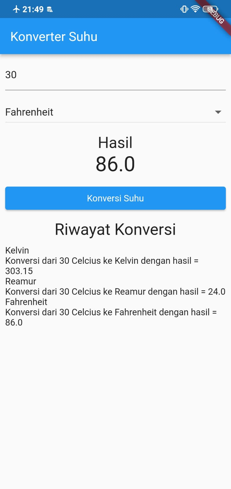
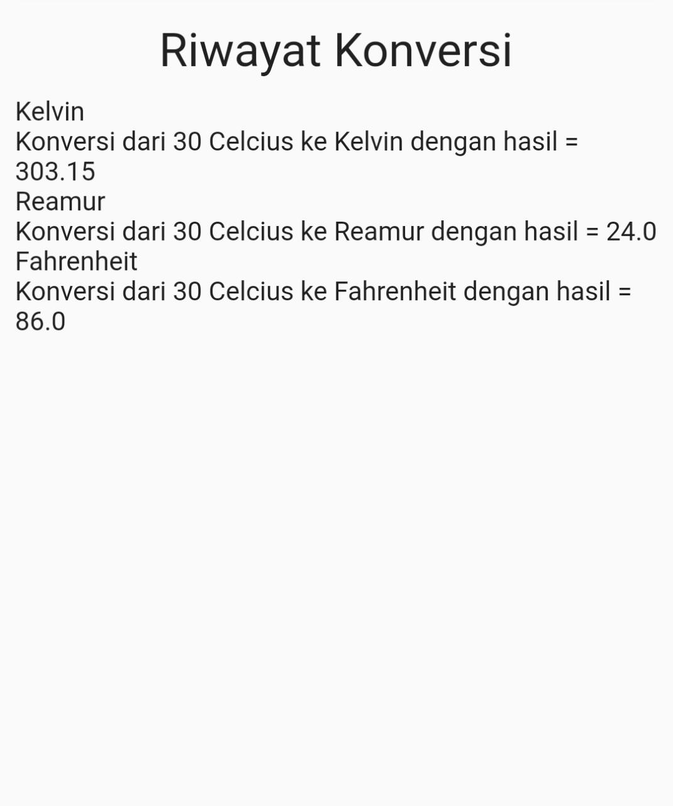

# Laporan Praktikum konversi_suhu_list

Nama : Karmila Novi Arfiana

Kelas : TI 3C

NIM : 2041720073

Absen : 12

## HASIL
## 1. Tampilan Awal

## 2. Memasukkan suhu dalam celsius dan mengkonversinya dengan kelvin

## 3. Memasukkan suhu dalam celsius dan mengkonversinya dengan reamur

## 4. Memasukkan angka suhu dalam celsius dan mengkonversinya dengan fahrenheit

## 5. Dan juga terdapat riwayat yang telah kita lakukkan

# konversi_suhu_list

A new Flutter project.

## Getting Started

This project is a starting point for a Flutter application.

A few resources to get you started if this is your first Flutter project:

- [Lab: Write your first Flutter app](https://docs.flutter.dev/get-started/codelab)
- [Cookbook: Useful Flutter samples](https://docs.flutter.dev/cookbook)

For help getting started with Flutter development, view the
[online documentation](https://docs.flutter.dev/), which offers tutorials,
samples, guidance on mobile development, and a full API reference.
